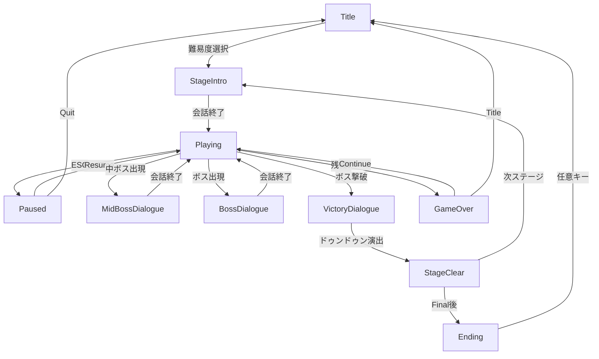

# ショット・オブ・モルト ゲームシステム設計書 v1.0

> 実装状況: 基盤システムは実装済み。本書は仕様の明文化と調整指針。

---

## 🎮 基本システム

### 自機仕様
| 項目 | 設定 | 備考 |
|------|------|------|
| 移動速度 | 通常: 6px/f / 低速: 2px/f | Shift押下で低速 |
| 当たり判定 | **半径 3px**（円形） | 低速時に可視化、東方準拠 |
| 汁舐め判定 | **半径 12px**（当たり判定の4倍） | この範囲で弾をかすめる |
| ショット | Z長押し | パワー依存で強化 |
| ラストバッチ | X | 無敵＋画面弾消し |

### 弾の当たり判定
| 弾タイプ | 見た目サイズ | 当たり判定 |
|---------|------------|----------|
| 小弾 | 8px | **4px**（50%） |
| 中弾 | 16px | **10px**（63%） |
| 大弾 | 32px | **20px**（63%） |
| レーザー | 幅8px | **幅4px**（50%） |

### 操作
| キー | アクション |
|------|----------|
| ↑↓←→ / WASD | 移動 |
| Z | ショット |
| X | ラストバッチ（ドゥンドゥン） |
| C | 属性切替（シェリー⇔バーボン）|
| Shift | 低速移動 |
| ESC | 設定メニュー |

---

## ⚡ コアシステム

### 1. パワーシステム
| 項目 | 値 | 説明 |
|------|-----|------|
| パワー範囲 | 0〜100 | 敵撃破・アイテムで増加 |
| 進化段階 | 0〜4（5段階）| 100到達ごとに進化 |
| 被弾ペナルティ | -20 | パワーダウン＋アイテム散乱 |

**ショット進化表**
| 進化Lv | ショット形態 | 火力倍率 |
|--------|-------------|---------|
| 0 | 単発 | ×1.0 |
| 1 | 2Way | ×1.3 |
| 2 | 3Way | ×1.6 |
| 3 | 4Way + ホーミング補助 | ×2.0 |
| 4 | 5Way + 強ホーミング | ×2.5 |

---

### 2. 汁舐めシステム
弾を**かすめる**ことでポイント＆ゲージ獲得。

| 項目 | 値 | 説明 |
|------|-----|------|
| 汁舐め判定半径 | 当たり判定の約3倍 | 調整可能 |
| 汁舐め1回あたり | +100点 | スコア加算 |
| ゲージ増加 | +1% | スペシャルゲージへ |
| 連続汁舐めボーナス | ×コンボ数 | コンボ中は倍率適用 |

**汁舐めの意味（世界観的）**
> 弾幕＝「自分を忘れないでほしい」というアピール。
> 汁舐め＝その想いを**舐めるように受け止める**行為。

---

### 3. スペシャルゲージ（ドゥンドゥンゲージ）
| 項目 | 値 | 説明 |
|------|-----|------|
| 最大値 | 100% | 汁舐めで蓄積 |
| 発動条件 | 100%到達 | 自動発動ではない |
| 発動効果 | 超火力 + ボム1回分の弾消し | 約3秒間 |
| 使用後 | 0%にリセット | |

**ドゥンドゥン発動時**
- 画面演出（ひなひなカットイン）
- 「ドゥンドゥン！」ボイス
- 一定時間、弾を消しながら高火力ショット

---

### 4. コンボシステム
| 項目 | 値 | 説明 |
|------|-----|------|
| コンボ増加 | 敵撃破ごとに+1 | |
| コンボ維持時間 | 2秒 | 撃破がないと途切れる |
| スコア倍率 | ×(1 + combo/10) | 10コンボで×2倍 |
| 最大コンボ | 無制限 | 記録として残る |
| 属性チェイン | 同属性連続撃破で追加ボーナス | 後述 |

---

### 5. 樽属性システム（斑鳩スタイル）🥃

**コンセプト**: ウイスキーの樽熟成になぞらえた2属性システム。
敵と弾に属性があり、自機も属性を切り替えられる。

#### 2つの属性
| 属性 | 色 | イメージ | 味わい |
|------|-----|---------|--------|
| **シェリー** | 赤茶/琥珀 | シェリー樽熟成 | 甘い・フルーティー |
| **バーボン** | 金/黄金 | バーボン樽熟成 | スパイシー・バニラ |

#### 属性の効果
| 状況 | 効果 |
|------|------|
| **同属性の弾に触れる** | 吸収してゲージ回復 |
| **異属性の弾に触れる** | ダメージ |
| **同属性の敵を攻撃** | 通常ダメージ |
| **異属性の敵を攻撃** | **2倍ダメージ** |

#### 操作
| キー | アクション |
|------|----------|
| C | 属性切替（シェリー⇔バーボン）|

#### 属性チェインボーナス
同じ属性の敵を連続撃破するとチェインボーナス:

| チェイン数 | ボーナス |
|-----------|---------|
| 3チェイン | ×1.5倍 |
| 5チェイン | ×2.0倍 |
| 10チェイン | ×3.0倍 |
| 20チェイン | ×5.0倍 |

**異属性を倒すとチェインリセット**（高リスク・高リターン）

#### 吸収ゲージ
| 項目 | 効果 |
|------|------|
| 弾吸収 | ドゥンドゥンゲージ+2% |
| 満タン時 | 自動でラストバッチ発動可能状態 |

#### 世界観的意味
> シェリー樽＝甘く深い、バーボン樽＝力強くスパイシー。
> 敵の「想い」の性質を理解し、同じ属性で受け止める（吸収）か、
> 異なる属性でぶつかる（攻撃）かを選ぶ。

---

### 5. ラストバッチシステム
| 項目 | 値 | 説明 |
|------|-----|------|
| 初期所持 | 3個 | ステージ開始時 |
| 最大所持 | 5個 | |
| 効果 | 無敵 + 弾消し | 約2秒間 |
| 被弾時自動発動 | あり | 残機が減る前に発動 |
| スコアペナルティ | なし | 使用推奨 |

---

### 6. 残機システム
| 項目 | 値 | 説明 |
|------|-----|------|
| 初期残機 | 3 | +エクステンド |
| エクステンド | 100万点ごと | 最大+3 |
| 被弾時 | ラストバッチあり→自動発動 / なし→残機-1 | |
| 復活位置 | 画面下部中央 | 短時間無敵 |
| コンティニュー | 3回まで | スコアリセット |

---

### 7. ひなひなアシストシステム 🍶

**コンセプト**: ひなひなは1面ボスとして登場後、仲間になってアシスト役に。
ボスを撃破するたびに**そのボスのFinal Batchを習得**し、攻撃・ボムが強化される。

#### Stage 1の制約
| 項目 | Stage 1 | Stage 2以降 |
|------|---------|------------|
| ラストバッチ | **使用不可** | 使用可能 |
| アシスト | なし | ひなひな参戦 |
| 理由 | まだひなひなと出会っていない | 仲間になった |

| 撃破ボス | 習得Batch | 効果 |
|---------|----------|------|
| Stage 1: ひなひな | なし（本人が仲間に）| ラストバッチ解禁 |
| Stage 2: 本坊 霞 | 「てへっ☆全部売っちゃった」| ラストバッチ範囲拡大 |
| Stage 3: 笹野川 風花 | 「260年の老舗の誇り」| ショット火力+10% |
| Stage 4: 新川 果林 | 「自然を傷つけてはいけませんわ」| 汁舐め判定拡大 |
| Stage 5: 桜ヶ丘 リン | 「本物を作るまでは死ねない」| ショット火力+20% |

#### ラストバッチ強化段階
| 段階 | 名前 | 効果 |
|------|--------|------|
| 初期 | ドゥンドゥン | 弾消し（標準範囲）|
| +霞 | ふわふわドゥンドゥン | 弾消し範囲1.3倍 |
| +風花 | 老舗ドゥンドゥン | 弾消し範囲1.3倍 + ダメージあり |
| +果林 | フルーティードゥンドゥン | 範囲1.5倍 + ダメージ + 回復 |
| +リン | 石炭直火ドゥンドゥン | 全画面 + 高ダメージ |

#### ストーリー連動
- ボス撃破後、ひなひながボスを「ドゥンドゥン」して邪気を払う演出
- Batch習得時に短いカットイン
- Final面では全Batchの力を結集した最終ラストバッチ

## 🎯 難易度システム

### 5段階難易度
| 難易度 | 弾速 | 弾密度 | Batch数 | 対象 |
|--------|------|--------|---------|------|
| あまい | 70% | 50% | 2つ | 初心者向け |
| うめ | 85% | 75% | 3つ | 入門者向け |
| からい | 100% | 100% | 全て | 標準 |
| ブオー | 120% | 120% | 全て+α | 上級者向け |
| カニ漁 | 150% | 150% | 全て+α+ | 狂人向け |

### 難易度別調整詳細
| 項目 | あまい | うめ | からい | ブオー | カニ漁 |
|------|------|-----|------|------|------|
| 残機 | 5 | 4 | 3 | 2 | 1 |
| ラストバッチ | 5 | 4 | 3 | 3 | 2 |
| 汁舐め判定 | 広い | 標準 | 標準 | 狭い | 極狭 |
| 敵耐久 | 80% | 90% | 100% | 110% | 130% |
| ボスHP | 70% | 85% | 100% | 120% | 150% |

### 弾幕の熱さ（難易度別）
| 項目 | あまい | うめ | からい | ブオー | カニ漁 |
|------|------|-----|------|------|------|
| 弾速 | 70% | 85% | 100% | 120% | 150% |
| 弾密度 | 50% | 75% | 100% | 130% | 180% |
| 発射間隔 | 150% | 120% | 100% | 80% | 60% |
| 同時発射数 | ×0.5 | ×0.75 | ×1.0 | ×1.3 | ×1.8 |
| 追加パターン | なし | なし | なし | +回転弾 | +誘導弾 |
| 自機狙い精度 | 低い | 普通 | 普通 | 高い | 超高い |

---

## 🏆 スコアシステム

### 基本得点
| 行動 | 得点 |
|------|------|
| ザコ撃破 | 100〜500点 |
| 中ボス撃破 | 10,000点 |
| ボス撃破 | 100,000点 |
| Batch撃破 | 50,000点/枚 |
| 汁舐め | 100点 |

### ボーナス得点
| 条件 | ボーナス |
|------|---------|
| ノーミスクリア | ×1.5倍 |
| ノーボムクリア | ×1.3倍 |
| フルコンボクリア | ×2.0倍 |
| 全Batch撃破 | +500,000点 |

---

## 📦 アイテム

| アイテム | 効果 | 見た目イメージ |
|---------|------|--------------|
| パワー（小）| +1 パワー | 小さな琥珀のしずく |
| パワー（大）| +10 パワー | 大きな琥珀のしずく |
| 得点 | +1,000点 | ★型 |
| ボム | +1 ボム | 銅色のワイングラス |
| 1UP | +1 残機 | 金色のボトル（レア）|
| フルパワー | 最大進化 | 虹色のボトル（超レア）|

## 🖥️ 画面遷移設計

### 画面状態一覧
| 状態 | 説明 |
|------|------|
| Title | タイトル画面（難易度選択含む）|
| StageIntro | ステージ開始前会話（かい＆ひなひなの掛け合い）|
| Playing | ゲームプレイ中 |
| Paused | ポーズメニュー |
| MidBossDialogue | 中ボス登場時会話（道中）|
| BossDialogue | ボス登場前会話 |
| VictoryDialogue | ボス撃破後会話（ドゥンドゥン演出含む）|
| StageClear | ステージクリア画面 |
| GameOver | ゲームオーバー画面 |
| Ending | エンディング |

#### 会話タイミング（東方スタイル）
| タイミング | 状態 | 内容 |
|-----------|------|------|
| ステージ開始時 | StageIntro | かい＆ひなひなの作戦会議 |
| 中ボス登場時 | MidBossDialogue | 短い掛け合い（スキップ可）|
| ボス登場時 | BossDialogue | ボスとの会話（世界観・動機）|
| ボス撃破後 | VictoryDialogue | ドゥンドゥン＆Batch習得 |

#### Playingサブフェーズ
Playing状態の中で発生する一時的なフェーズ（GameStateは変わらない）:

| フェーズ | 説明 | 時間 | 処理 |
|---------|------|------|------|
| **StageStart** | ステージ開始直後 | 1.0秒 | 自機無敵、操作可能 |
| **Respawn** | 被弾後の復活 | 2.0秒 | 自機無敵、点滅表示 |
| **MidBossWarning** | 中ボス出現前 | 1.5秒 | 警告表示、雑魚退場 |
| **BossWarning** | ボス出現前 | 2.0秒 | 画面暗転、雑魚退場 |
| **BossDefeat** | ボス撃破直後 | 1.5秒 | 爆発演出、弾消し |
| **BatchAnnounce** | Batch名表示 | 1.0秒 | カットイン、弾幕名表示 |
| **LastBatchActive** | ラストバッチ発動中 | 2.0秒 | 無敵、弾消し演出 |

### 画面遷移フロー

### 各画面の詳細

#### タイトル画面 (Title)
| 要素 | 内容 |
|------|------|
| 背景 | タイトルイラスト（ひなひな＆かい）|
| 選択項目 | Start / Difficulty / Options / Exit |
| 難易度選択 | あまい / うめ / からい / ブオー / カニ漁 |
| BGM | タイトルBGM |

#### プレイ中 (Playing)
| 要素 | 内容 |
|------|------|
| UI表示 | スコア / ハイスコア / 残機 / ラストバッチ数 |
| | パワー / 汁舐め数 / コンボ / 属性ゲージ |
| | ドゥンドゥンゲージ / 現在属性 |
| ボス戦時 | ボスHP / Batch名 / 残りBatch数 |

#### ポーズメニュー (Paused)
| 要素 | 内容 |
|------|------|
| 選択項目 | Resume / Retry / BGM Volume / SFX Volume / Quit |
| 表示 | 現在のスコア / プレイ時間 |

#### ボス会話 (BossDialogue / VictoryDialogue)
| 要素 | 内容 |
|------|------|
| 表示 | 立ち絵（左:自機 / 右:ボス）|
| | セリフ（タイプライター効果）|
| 操作 | Z: 次へ / X: スキップ |
| 勝利後 | ひなひながドゥンドゥンする演出 |

#### ステージクリア (StageClear)
| 要素 | 内容 |
|------|------|
| 表示 | クリアイラスト |
| | スコア / ボーナス内訳 |
| | 習得Batch（ある場合）|
| 演出 | Batch習得カットイン |

#### ゲームオーバー (GameOver)
| 要素 | 内容 |
|------|------|
| 選択項目 | Continue（残り回数表示）/ Title |
| 表示 | 最終スコア / 到達ステージ |

#### エンディング (Ending)
| 要素 | 内容 |
|------|------|
| 演出 | スタッフロール / エンディングイラスト |
| | 達成ボーナス表示 |
| 分岐 | ノーコンティニュー時：特別演出 |

### フェード効果
| 遷移 | 効果 | 時間 |
|------|------|------|
| **Title → Playing** | ブラックアウト → フェードイン | 2.0秒 |
| **任意 → Title** | フェードアウト → ブラックアウト → フェードイン | 2.0秒 |
| Stage間 | フェードアウト → フェードイン | 0.5秒 |
| ボス登場 | 画面暗転 → 立ち絵スライドイン | 1.0秒 |
| ステージ開始 | 黒画面 → ステージ名表示 → フェードイン | 1.5秒 |
| GameOver表示 | スローモーション → フェードアウト | 1.5秒 |

---

## 🎵 サウンド設計

### BGM一覧
| ID | ファイル名 | 使用場面 | 備考 |
|----|-----------|---------|------|
| bgm_op | bgm_op.mp3 | タイトル画面 | ループ再生 |
| bgm_stage | bgm_stage.mp3 | 道中（汎用）| ループ再生 |
| bgm_stage1_normal | bgm_stage1_normal.mp3 | Stage 1 道中 | ステージ専用 |
| bgm_stage1_boss | bgm_stage1_boss.mp3 | Stage 1 ボス戦 | ステージ専用 |
| bgm_boss | bgm_boss.mp3 | ボス戦（汎用）| ループ再生 |
| bgm_ed | bgm_ed.mp3 | エンディング | 1回再生 |

#### ステージ別BGM（未作成含む）
| ステージ | 道中BGM | ボスBGM |
|---------|---------|---------|
| Stage 1: 白州 | bgm_stage1_normal | bgm_stage1_boss |
| Stage 2: 駒ヶ岳 | （要作成）| （要作成）|
| Stage 3: 安積 | （要作成）| （要作成）|
| Stage 4: 宮城峡 | （要作成）| （要作成）|
| Stage 5: 余市 | （要作成）| （要作成）|
| Final: 軽井沢 | （要作成）| （要作成）|

#### 曲名一覧
| ステージ | 曲名（道中）| 曲名（ボス）|
|---------|----------|-----------|
| Stage 1 | 「森と水のほとり」| 「妖精の午睡」|
| Stage 2 | 「駒ヶ岳の麓にて」| 「てへっ☆蒸留所売却」|
| Stage 3 | 「会津の誇り」| 「260年の老舗」|
| Stage 4 | 「峡谷を吹く風」| 「自然を傷つけてはいけませんわ」|
| Stage 5 | 「北の大地」| 「本物への執念」|
| Final | 「幻の蒸留所」| 「冬の時代の遺産」|

#### 曲名表示仕様（東方スタイル）
| 項目 | 仕様 |
|------|------|
| 表示位置 | 画面右下 |
| 表示タイミング | BGM開始時 |
| 表示形式 | ♪「曲名」|
| フェード | 1秒フェードイン → 3秒表示 → 1秒フェードアウト |
| フォント | 小さめ、白文字に黒縁取り |

### SE一覧
| ID | ファイル名 | 再生タイミング |
|----|-----------|--------------|
| shot | player_shot.mp3 | 自機ショット |
| bomb | bomb.mp3 | ラストバッチ発動 |
| enemy_hit | enemy_hit.mp3 | 敵にダメージ |
| enemy_die | enemy_die.wav | 敵撃破 |
| cursor | cursor.mp3 | メニューカーソル移動 |
| confirm | confirm.mp3 | メニュー決定 |
| spellcard | stage1_boss_spellcard.wav | Batch発動時 |
| hina_buoo | hina_buoo.wav | ひなひなボイス（ブオー）|
| hina_eyao | hina_eyao.wav | ひなひなボイス（えやお）|

#### 未作成SE（必要なもの）
| ID | 再生タイミング | 優先度 |
|----|--------------|--------|
| graze | 汁舐め発生時 | 高 |
| item_get | アイテム取得 | 高 |
| power_up | パワーアップ | 中 |
| extend | 残機増加 | 高 |
| boss_appear | ボス登場 | 中 |
| boss_defeat | ボス撃破 | 高 |
| absorb | 属性弾吸収 | 高 |
| attribute_change | 属性切替 | 高 |
| player_damage | 被弾 | 高 |
| continue | コンティニュー | 中 |
| cancel | メニューキャンセル | 高 |
| pause | ポーズ開始/解除 | 中 |
| warning | ボス出現警告 | 高 |
| chain_up | チェインボーナス達成 | 中 |
| gameover | ゲームオーバー時 | 高 |
| victory_jingle | ボス撃破ジングル | 高 |
| text_advance | 会話テキスト送り | 中 |

### ボイス一覧
| キャラ | ID | 内容 | タイミング |
|--------|-----|------|----------|
| ひなひな | hina_doon | 「ドゥンドゥン！」| ラストバッチ発動 |
| ひなひな | hina_buoo | 「ブオー！」| 既存 |
| ひなひな | hina_eyao | 「えやお！」| 既存 |
| ひなひな | hina_yatta | 「やったー！」| ボス撃破時 |
| かい | kai_damage | 「うっ」| 被弾時 |
| かい | kai_extend | 「よし！」| 残機増加時 |
| かい | kai_boss | 「来た…！」| ボス登場時 |
| ボス | boss_intro | （個別）| 登場時 |
| ボス | boss_defeat | （個別）| 撃破時 |

### BGM切替タイミング
| トリガー | 動作 |
|---------|------|
| ステージ開始 | 道中BGMをフェードイン |
| BossWarning | 道中BGMフェードアウト（1秒）|
| BossDialogue終了 | ボスBGMをフェードイン |
| ボス撃破 | ボスBGMフェードアウト |
| VictoryDialogue | 勝利ジングル再生 |
| StageClear → 次Stage | 次Stage道中BGM |
| GameOver | BGMフェードアウト → 無音 |

---

## 🔧 今後の調整ポイント

1. **汁舐め半径**: 大きすぎると簡単、小さすぎると爽快感なし
2. **コンボ維持時間**: 短すぎるとストレス、長すぎると緊張感なし
3. **ドゥンドゥンゲージ**: 溜まる速度のバランス
4. **難易度曲線**: Stage 3あたりが急激に難しくならないよう注意

---

## 📋 実装チェックリスト

- [x] パワーシステム（進化Lv 0-4）
- [x] 汁舐めシステム
- [x] スペシャルゲージ
- [x] コンボシステム
- [x] 5段階難易度
- [x] ボム（自動発動含む）
- [x] 残機・コンティニュー
- [ ] アイテムドロップバランス調整
- [ ] 難易度別パラメータ微調整
- [ ] ひなひなアシストシステム
- [ ] Batch習得・ボム強化演出
